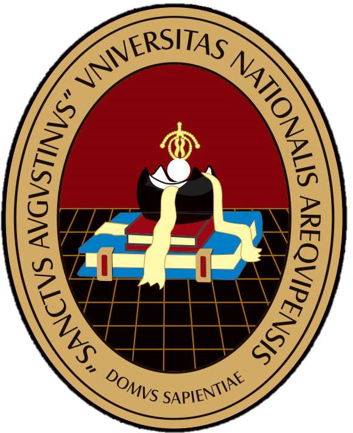

<!-- Contenedor principal centrado -->
<div align="center">

  <!-- Contenedor para logo y título -->
  <div style="display: flex; align-items: center; justify-content: center;">
    <!-- Imagen superior izquierda -->
    <div style="display: inline-block; vertical-align: middle;">
      
    </div>
    <!-- Espacio entre imagen y título -->
    <div style="display: inline-block; width: 20px;"></div>
    <!-- Título principal -->
    <div style="display: inline-block; vertical-align: middle;">
      <h1 style="margin: 0;">UNIVERSIDAD NACIONAL DE SAN AGUSTÍN</h1>
    </div>
  </div>

  <!-- Imagen central debajo del título -->
  <p align="center">
    
  </p>

  <!-- Facultad y Escuela -->
  <div style="text-align: center; margin-top: 20px;">
    <h2 style="margin: 0;">FACULTAD DE INGENIERÍA DE PRODUCCIÓN Y SERVICIOS</h2>
    <h3 style="margin: 0; font-weight: normal;">ESCUELA PROFESIONAL DE INGENIERÍA DE SISTEMAS</h3>
  </div>

  <!-- Contenido centrado -->
  <p align="center">
    <strong>DOCENTE:</strong><br>
    NORMAN PATRICK HARVEY ARCE<br><br>
    <strong>CURSO:</strong><br>
    PROGRAMACIÓN DE SISTEMAS - TEORIA GRUPO A<br><br>
    <strong>TEMA:</strong><br>
    PROYECTO FINAL: PROGRAMA ADMIN EN LINUX<br><br>
    <strong>CARRERA:</strong><br>
    ESCUELA PROFESIONAL DE INGENIERÍA DE SISTEMAS<br><br>
    <strong>INTEGRANTES:</strong><br>
    CONDORI CATUNTA, JOSELIN SHARON<BR>
    ROJAS CONDORI, FABIANA PAOLA<br>
    SCHREIBER LANDEO, DIEGO HANS<br>
    AREQUIPA-PERÚ<br>
    2026
  </p>
</div>

------------

## Descripción

**ADMIN LINUX** es un proyecto desarrollado en lenguaje C como trabajo final del curso de **Programación de Sistemas**. La aplicación integra diferentes herramientas de administración para sistemas Linux mediante una interfaz basada en menús, permitiendo gestionar procesos, archivos, respaldos, comandos del sistema, análisis de scripts Bash y una cola de descargas.

El proyecto tiene como finalidad aplicar conceptos fundamentales de programación de sistemas, tales como el uso de procesos, llamadas al sistema, manejo de archivos, ejecución de comandos del sistema operativo, modularización del código y automatización de tareas en entornos Linux.

---

## Funcionalidades

El sistema implementa los siguientes módulos:

- Administración de procesos.
- Shell para la gestión de archivos.
- Ejecución de comandos Linux.
- Sistema de creación y restauración de respaldos.
- Analizador de scripts Bash.
- Cola de descargas.
- Información del sistema, monitoreo de recursos y datos principales del sistema Linux.

---

## Estructura del proyecto

```text
.
├── backups/          # Archivos de respaldo
├── bin/              # Ejecutable generado
├── downloads/        # Archivos descargados
├── include/          # Archivos de cabecera
├── logs/             # Archivos de registro
├── scripts/          # Scripts auxiliares
├── src/              # Código fuente
├── Makefile
└── README.md
```

---

## Requisitos

- Sistema operativo Linux.
- Compilador GCC.
- GNU Make.

---

## Compilación

Clonar el repositorio:

```bash
git clone https://github.com/FabianaRojasCondori/Programaci-n-de-Sistemas---PROYECTO-FINAL-.git
cd Programaci-n-de-Sistemas---PROYECTO-FINAL-
```

Compilar el proyecto:

```bash
make
```

---

## Ejecución

Una vez compilado el proyecto, ejecutar:

```bash
./bin/admin_linux
```

---

## Menú principal

```text
===========================
        ADMIN LINUX
===========================

1. Administrador de procesos
2. Shell de archivos
3. Ejecutar comandos Linux
4. Sistema de respaldos
5. Analizador Bash
6. Cola de descargas
7. Informacion del Sistema
0. Salir
```

---

## Conceptos aplicados

Durante el desarrollo del proyecto se aplicaron los siguientes conceptos de Programación de Sistemas:

- Gestión de procesos.
- Llamadas al sistema (System Calls).
- Manejo de archivos.
- Ejecución de comandos del sistema operativo.
- Obtención de información del sistema mediante comandos Linux.
- Automatización mediante Bash.
- Modularización del código.
- Compilación mediante Makefiles.
- Obtención de información del sistema mediante comandos Linux.
- Creación y sincronización de procesos mediante fork(), exec() y wait().

---

## Licencia

Este proyecto fue desarrollado con fines exclusivamente académicos como parte del curso **Programación de Sistemas** de la **Universidad Nacional de San Agustín de Arequipa**.
